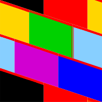
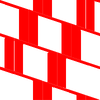

<p align="center"></p>

Roya is a small low-level image comparison library.

[](https://badge.fury.io/js/roya)
[](https://coveralls.io/github/mouafa/roya?branch=master)
[](https://travis-ci.org/mouafa/roya#)

Inspired by [pixelmatch](https://github.com/mapbox/pixelmatch) with more bells and whistles.

## Installation

using yarn

```bash
yarn add roya
```

using npm

```bash
npm i -S roya
```

### API

```
roya(img1, img2, [, options])
```

`img1`, `img2` — Image data of type `Buffer` of the images to compare

`options` Optional object options with the following properties:

| Property       | Description                                                                                                    | Default     |
| -------------- | -------------------------------------------------------------------------------------------------------------- | ----------- |
| threshold      | Matching threshold, ranges from 0 to 1. Smaller values make the comparison more sensitive                      | 0.1         |
| highlightFade  | Highlight color intensity will depend on the pixel ditance value                                               | true        |
| highlightColor | The used highlight color, should be an array of [R,G,B] values                                                 | [255, 0, 0] |
| transparent    | Whether to keep the original image ot to use a blank convas to highlight the diff                              | false       |
| overlapse      | Whether to use the highlight color or use the changing pixel itself                                            | false       |
| method         | Matching and diffing method to be used, should be one of the available methods, rgb, rgbTuned, yiq or yiqTuned | 'rgb'       |

**P.S.** rgb method is the fastest but it might not be the best for your usecase, try the others method and pick the right one for you.

### Example:

| img1                            | img2                            |
| ------------------------------- | ------------------------------- |
|  |  |

| options                                        | result                                           |
| ---------------------------------------------- | ------------------------------------------------ |
| `undefined`                                    |           |
| `{ threshold: 0.5 }`                           |  |
| `{ highlightColor: [255, 255, 0] }`            |            |
| `{ highlightFade: false }`                     |             |
| `{ transparent: true, highlightFade: false }`  |       |
| `{ overlapse: true, transparent: true }`       |         |
|                                                |
| `{ method: 'rgb', highlightFade: false }`      |        |
| `{ method: 'rgbTuned', highlightFade: false }` |   |
| `{ method: 'yiq', highlightFade: false }`      |        |
| `{ method: 'yiqTuned', highlightFade: false }` |   |

## Usage

```js
const fs = require('fs')
const PNG = require('pngjs').PNG
const roya = require('roya')

var img1 = fs
  .createReadStream('img1.png')
  .pipe(new PNG())
  .on('parsed', parsed)

var img2 = fs
  .createReadStream('img2.png')
  .pipe(new PNG())
  .on('parsed', parsed)

let done = 0
function parsed() {
  done++
  if (done < 2) return
  const out = roya(img1.data, img2.data)

  const diff = new PNG({ width: img1.width, height: img1.height })

  diff.data = out.data

  diff
    .pack()
    .pipe(fs.createWriteStream('diff.png'))
    .on('finish', () => console.log('done'))
}
```

**P.S.** image dimensions must be equal.
